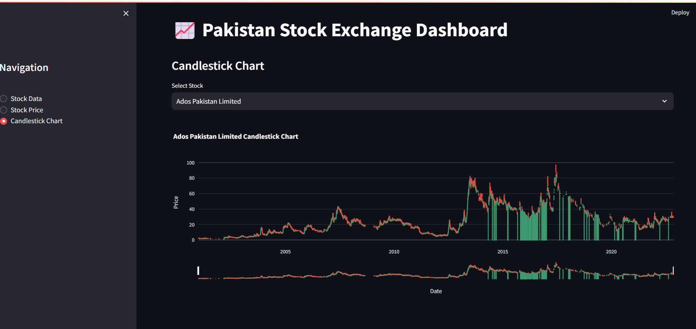

# Pakistan Stock Exchange Dashboard

This Streamlit-based dashboard provides insights into the Pakistan Stock Exchange (PSX) data, allowing users to analyze stock prices, trends, and more.

## Features

- **Stock Data:** View data of various stocks listed on the Pakistan Stock Exchange.
- **Stock Price:** Analyze stock price movements over time, with options to customize plot types.
- **Candlestick Chart:** Visualize stock price data using candlestick charts.

## Setup

1. Clone the repository:

2. Install the required dependencies:

3. Run the dashboard:

4. Access the dashboard in your web browser at `http://localhost:8501`.

## Data Sources

- Stock symbols are read from the `PSX.csv` file.
- Historical stock data for each symbol is expected to be stored in CSV files named `<symbol>.csv`.

## Usage

1. Choose the desired section from the sidebar navigation.
2. Select a stock or date range (where applicable) to view the corresponding data.
3. Explore the interactive plots and charts to analyze stock performance and trends.

## Contributing

Contributions are welcome! If you find any issues or have suggestions for improvements, please open an issue or submit a pull request.

## License

This project is licensed under the MIT License. See the [LICENSE](LICENSE) file for details.

